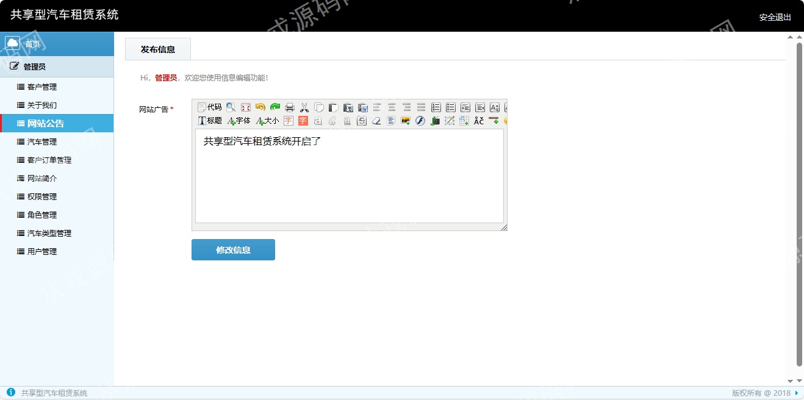
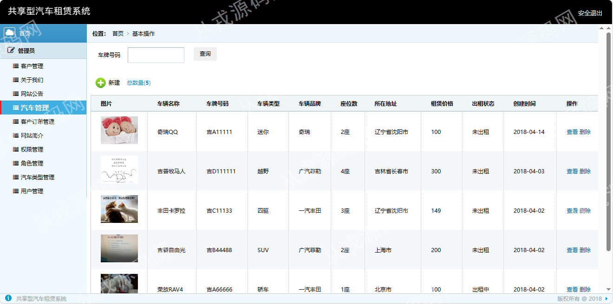
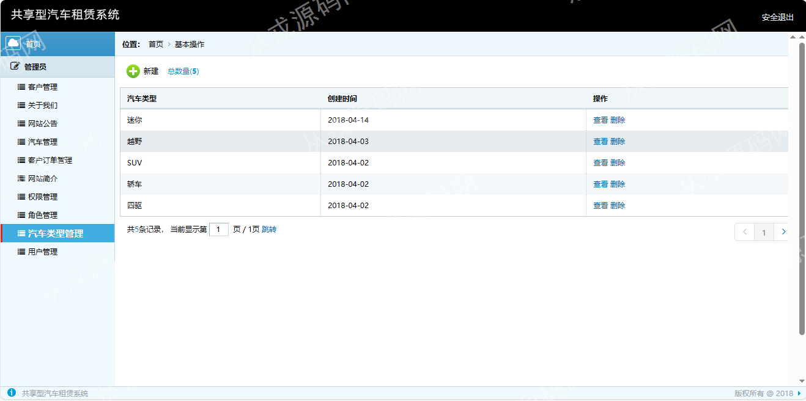

<h1 align="center">64.共享型汽车租赁管理系统</h1>

 获取sql文件 QQ: 386869957 QQ群: 377586148 

 [推荐站点: 从戎源码网](https://armycodes.com/) 

## 简介

> 本代码来源于网络,仅供学习参考使用! 
>
> 提供1.远程部署/2.修改代码/3.设计文档指导/4.框架代码讲解等服务
> 
> http://localhost:8080/user/logout
> 
> 管理员：admin 1
> 
> 用户：abc 1
> 
>

## 项目介绍
基于ssm的共享型汽车租赁管理系统：有配套报告文档，前端jsp、jquery、bootstrap，后端 springmvc、spring、mybatis，集成汽车租赁、客户管理、汽车管理、网站公告等功能于一体的系统。

## 功能介绍

### 管理员

- 客户管理：客户列表查询
- 关于我们：内容富文本编辑，对应前台网站的关于我们部分内容显示
- 网站公告：公告发布，对应前台网站公告内容的显示
- 汽车管理：汽车信息的增删改查，车牌号搜索，汽车图片上传
- 客户订单管理：客户订单列表查询，此处记录是前台用户下单，订单记录删除
- 网站简介：内容富文本编辑，对应前台网站的简介部分内容显示
- 权限管理：权限名称和访问地址绑定关系，权限信息的增删改查
- 角色管理：角色信息的增删改查，角色勾选赋予的权限，可多选
- 汽车类型管理：汽车类型信息的增删改查
- 用户管理：用户信息的增删改查，包含密码设置，可用于系统登录

### 用户

- 基本功能：登录、注册、退出、我的信息查看和修改
- 汽车租赁：汽车信息列表展示，汽车搜索，汽车详情，我要租赁
- 我的订单：订单列表，用户租赁后会在我的订单列表中显示，便于用户订单信息的查询，租赁中的汽车订单可以选择归还操作

## 环境

- <b>IntelliJ IDEA 2021.3</b>

- <b>Mysql 5.7.26</b>

- <b>Tomcat 7.0.73</b>

- <b>JDK 1.8</b>

## 运行截图

